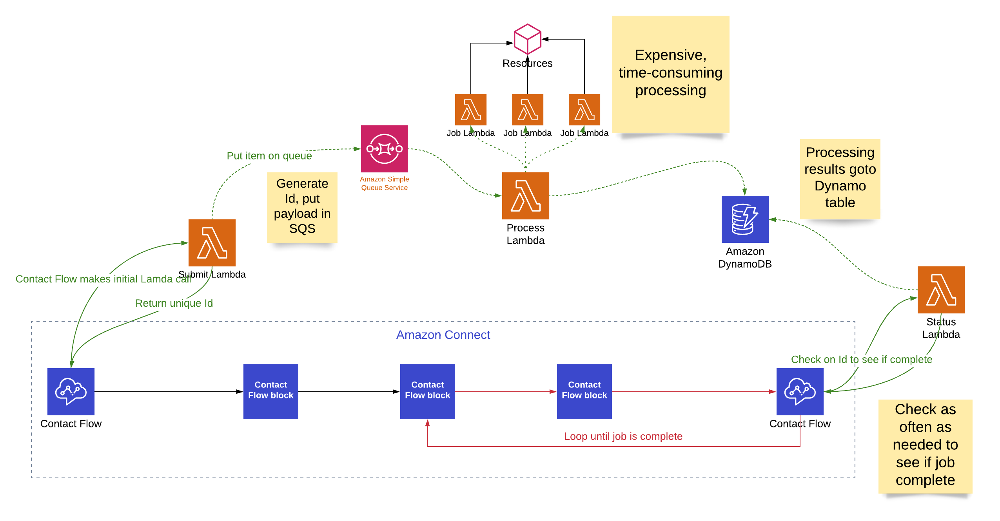

# connect-async-job

Amazon Connect asynchronous jobs

Problem statement: Amazon Connect contact flows can execute lambda functions but the timeout is limited to 8s max. If the lambda needs to perform a long running task - connect to an external system, perform complicated business logic, etc - the lambda invocation will time out.

This solution uses the concept of a "job". A job is submitted in the contact flow and placed in SQS.  The processing lambda gets the job from SQS, saves the metadata about the job to Dynamo and then calls the appropriate job lambda. When the job is complete, the job metadata in Dynamo is updated.  The status lambda checks the Dynamo table (as often as necessary) to get the state of the job.

## install

To Do - update install instructions
